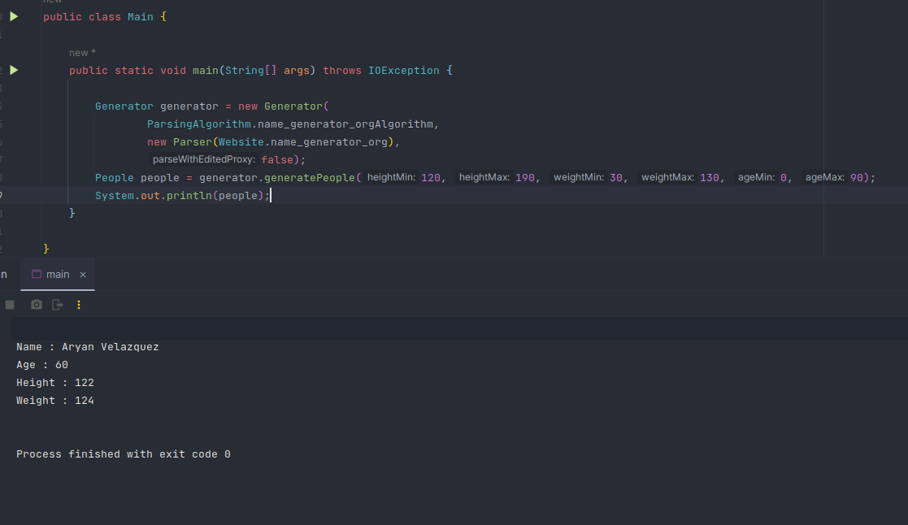

# User Generator v2

> English version will be available by August 21st.

- [Главная](#user-generator-v2)
  - [Пример, краткое описание](#пример)
  - [Принцип](#принцип)
    - [Parser](#класс-parser)
      - [ConnectParameter](#класс-connectparameter)
      - [ConnectParameters](#класс-connectparameters)
    - [ParsingAlgorithm](#класс-parsingalgorithm)
    - [Generator](#класс-generator)
    - [People](#класс-people)
  - [Будущие обновления](#будущие-обновления)
  - [Релизы](#релизы)
  - [Внимание](#внимание)
  - [Благодарности](#благодарности)

Библиотека "User Generator" - это библиотека для создания объектов класса People хранящие в себе различную информацию, она создана для тестирования различных приложений/ программ/ библиотек/ пакетов/ и тд.

## Пример



Выше приведен пример использования, на нем объект Generator возвращает значение типа People, хранящее в себе случайную информацию. Весь выше-написанный код будет объяснен ниже.

## Принцип

User Generator v2 использует библиотеку Jsoup. [Parser](#класс-parser) подключается к сайту [name-generator.org](https://www.name-generator.org.uk/quick/) и берет от туда случайные имя и фамилию, которые генерируются при каждом заходе на сайт. Также есть возможность отдельно взять объект типа Document и/или Elements.

### [Класс Parser](src/main/java/com/fbs/util/Parser.java)

Служит для извлечения информации с сайта и дальнейшего его возвращения кав объекта типа Document. Для настройки функции `connect()` используется классы типа [ConnectParameter](#класс-connectparameter), и [ConnectParameters](#класс-connectparameters), исключение `timeout` имеющее тип `int`. В классе имеются два метода: `getDocument()` и `getDocumentUsingProxy()`, отличие заключается в том, что в методе `getDocumentUsingProxy()` вместе с другими параметрами передается параметр **proxy** с помощью метода `proxy()`.

Присвоение параметрам их значение происходит в методе `initConnectParameters()`, данный метод имеет модификатор доступа `public`, что позволяет относительно просто присвоить сторонние значения при создании.

```java
Parser parser = new Parser(Website.name_generator_org){
    @Override
    public void initConnectParameters() {
        super.initConnectParameters();
        // Место для переопределения параметров
    }
};
```
Но, параметры имеют свои стандартные параметры:

| Имя параметра | Значение параметра(1) | Значение параметра(2) |
|---------------|-----------------------|-----------------------|
| userAgent     | "Mozilla"             | _Не существует_       |
| cookie        | "cookieValue0"        | "cookieValue1"        |
| referrer      | "https://google.com"  | _Не существует_       |
| header        | "headerValue0"        | "headerValue1"        |
| data          | ""                    | ""                    |
| proxy         | ""                    | _Не существует_       |

#### [Класс ConnectParameter](src/main/java/com/fbs/data/ConnectParameter.java)

Представляет собой класс с приватными полями типа `Object` _для значений параметра_, и `String` _для имени параметра_.
```java
private String parameterName;

private Object parameterValue0, parameterValue1;
```

В классе имеются методы для получения или установки значений параметра.

Для получения значений параметра в версии 1.0.0:
```java
    public String getParameterName(){
        return parameterName;
    }

    public @Nullable Object getParameterValue(int index){
        return switch (index) {
            case 0 -> parameterValue0;
            case 1 -> parameterValue1;
            default -> null;
        };
    }
```

Для установки параметров в версии 1.0.0:

```java
    public void setParameterValue(int index, Object value){
        switch (index) {
            case 0 -> parameterValue0 = value;
            case 1 -> parameterValue1 = value;
        };
    }
    
    public void setParameterValue(Object value){
        parameterValue0 = value;
    }
    public void setParameterValues(Object value0, Object value1){
        parameterValue0 = value0;
        parameterValue1 = value1;
    }
```

#### [Класс ConnectParameters](src/main/java/com/fbs/data/ConnectParameters.java)

ConnectParameters является массивом ConnectParameter, который имеет методы для упрощения работы с ним, как с массивом.

В версии 1.0.0 имеет следующие методы:

```java
public ArrayList<ConnectParameter> getParameters() {
        return parameters;
}

public @Nullable ConnectParameter getByName(String parameterName){
    for (ConnectParameter parameter : parameters){
        if (Objects.equals(parameter.getParameterName(), parameterName)){
            return parameter;
        }
    }
    return null;
}
```

Метод `getByName(String name)`, принимает имя параметра и среди принадлежащих параметров 

### Класс ParsingAlgorithm

### Класс Generator

### Класс People

### Класс Website

## Будущие обновления

## Релизы

## Внимание

> Эта библиотека создана для случайной генерации человеческих параметров для использования их для тестирования каких либо приложений/ программ/ библиотек/ пакетов/ и тд. Все совпадения с реальными людьми исключительная случайность и автор не пытается унизить или оскорбить кого либо.

## Благодарности

+ [Jsoup](https://github.com/jhy/jsoup)
+ [name-generator.org](https://www.name-generator.org.uk/quick/)
+ [JetBrains за аннотации](https://github.com/JetBrains/java-annotations)